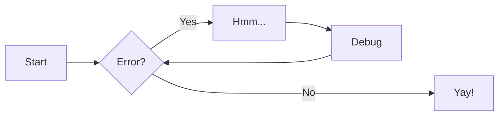
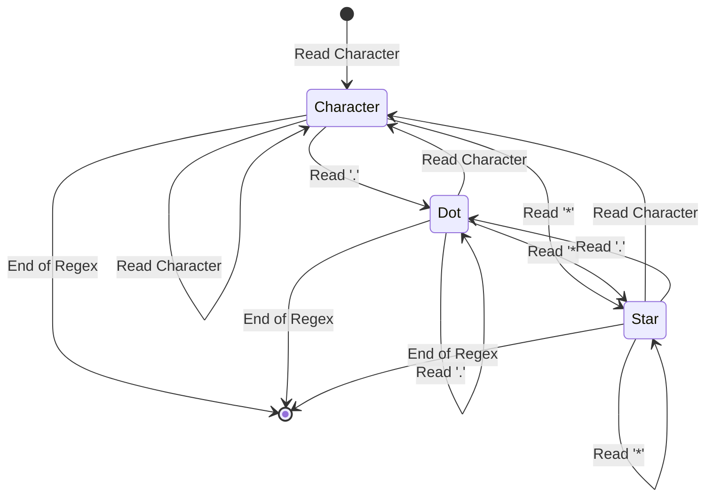

# code

```tree
root1            # comment 1
    file1
    dir1
        file
    dir2
        file1    # comment 2
        file2    # comment 3
    file2
    file3
root2
    file1
```

# mermaid





# katex

To render katex contents by extra.js, import assets before render.

```html
<!-- Katex -->
<link
    rel="stylesheet"
    href="https://cdn.jsdelivr.net/npm/katex/dist/katex.min.css"
/>
<script
    defer
    src="https://cdn.jsdelivr.net/npm/katex/dist/katex.min.js"
></script>
<script
    defer
    src="https://cdn.jsdelivr.net/npm/katex/dist/contrib/auto-render.min.js"
></script>
<script
    defer
    src="https://cdn.jsdelivr.net/npm/katex/dist/contrib/copy-tex.min.js"
></script>
```

<!-- Katex -->
<link rel="stylesheet" href="https://cdn.jsdelivr.net/npm/katex/dist/katex.min.css">
<script defer src="https://cdn.jsdelivr.net/npm/katex/dist/katex.min.js"></script>
<script defer src="https://cdn.jsdelivr.net/npm/katex/dist/contrib/auto-render.min.js"></script>
<script defer src="https://cdn.jsdelivr.net/npm/katex/dist/contrib/copy-tex.min.js"></script>

---

inline math: `#!math \( p(x|y) = \frac{p(y|x)p(x)}{p(y)} \)`

---

begin align

```tex
\begin{align}
p(v*i=1|\mathbf{h}) & = \sigma\left(\sum_j w*{ij}h*j + b_i\right) \\
p(h_j=1|\mathbf{v}) & = \sigma\left(\sum_i w*{ij}v_i + c_j\right)
\end{align}
```

```math
\begin{align}
p(v*i=1|\mathbf{h}) & = \sigma\left(\sum_j w*{ij}h*j + b_i\right) \\
p(h_j=1|\mathbf{v}) & = \sigma\left(\sum_i w*{ij}v_i + c_j\right)
\end{align}
```

---

bracket

```tex
\[
    p(v_i=1|\mathbf{h}) = \sigma\left(\sum_j w_{ij}h_j + b_i\right) \\
    p(h_j=1|\mathbf{v}) = \sigma\left(\sum_i w_{ij}v_i + c_j\right)
\]
```

```math
\[
    p(v_i=1|\mathbf{h}) = \sigma\left(\sum_j w_{ij}h_j + b_i\right) \\
    p(h_j=1|\mathbf{v}) = \sigma\left(\sum_i w_{ij}v_i + c_j\right)
\]
```
